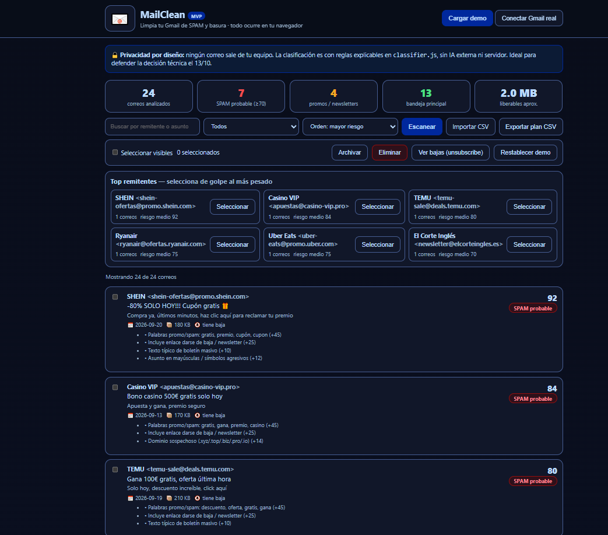
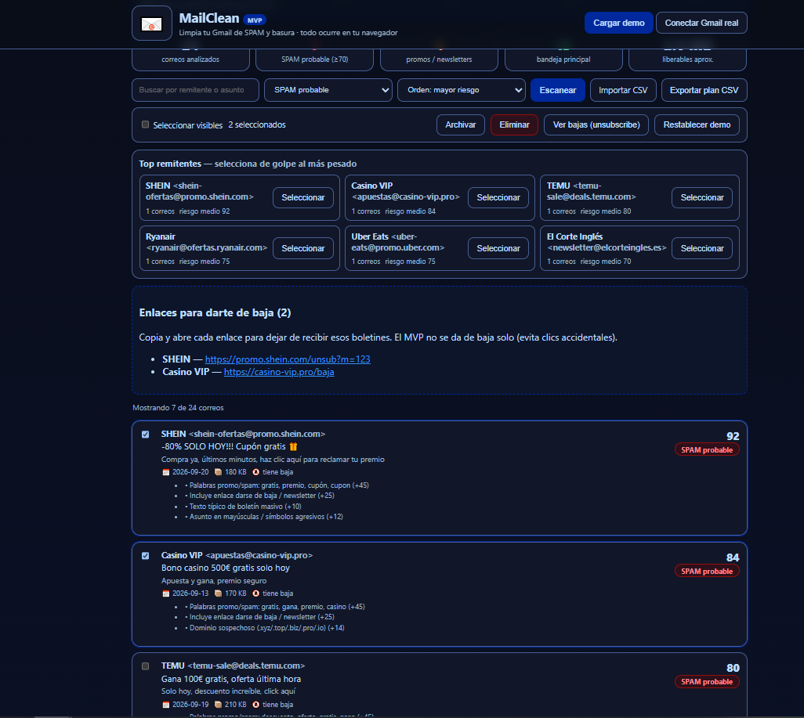

# MailClean — Gmail SPAM cleaner, everything explainable

[](https://github.com/Punysh6r/spam-cleaner-gmail/actions)
[](index.html)
[](styles.css)
[](classifier.js)
[](tests/run-tests.js)
[](classifier.js)
[](docs/DECISION_LOG.md)
[](LICENSE)

Limpia tu Gmail de SPAM y basura (SHEIN, TEMU, casinos, phishing, newsletters eternas) con un clasificador **explicable 0–100**: cada veredicto muestra sus motivos, nada sale de tu navegador y el plan de limpieza se exporta en CSV. Built as a course MVP: every decision is documented in [`docs/DECISION_LOG.md`](docs/DECISION_LOG.md).

**Live demo:** https://spam-cleaner-gmail.vercel.app

<p align="center">
  <a href="docs/screenshots/1-overview.png"></a>
  <a href="docs/screenshots/2-limpieza.png"></a>
</p>

> Capturas reales de la demo: a la izquierda el análisis completo (24 correos, cada score con sus motivos); a la derecha la limpieza en acción (filtro SPAM, *top remitentes* y lista *unsubscribe*).

## What it does

- **Demo en 1 clic** — 24 correos realistas (spam, promos, newsletters e importantes como la factura o el email del profe).
- **Clasificador explicable** — `classify()` en [`classifier.js`](classifier.js): keywords ES/EN, unsubscribe, mayúsculas agresivas, remitente repetido, TLD sospechoso y phishing, con umbrales ≥70 spam / 45–69 promo / <45 bandeja.
- **Dashboard** — totales, % spam y MB liberables estimados.
- **Limpieza en lote** — archivar, eliminar (simulado y reversible), lista de enlaces unsubscribe y buscador + filtros + orden.
- **Puente con Gmail real** — importa tu CSV (`from,subject,snippet,date,sizeKB,hasUnsubscribe`) con parser robusto (comillas, comas, CRLF); exporta el plan de limpieza como evidencia.
- **Top remitentes** — agrupa por remitente para seleccionar de golpe al spammer más pesado.
- **16 tests + CI** — `npm test` y GitHub Actions en cada push.

## Results (verificados por tests)

| Caso | Score | Categoría |
|---|---|---|
| SHEIN “-80% SOLO HOY!!! Cupón gratis” | 92 | SPAM probable |
| Phishing “tu cuenta será bloqueada” (.xyz) | 67 | Promo / revisar (con aviso phishing) |
| Factura de la luz | 0 | Bandeja principal |
| Email del profesor | 0 | Bandeja principal |

Los umbrales están fijados en [`tests/run-tests.js`](tests/run-tests.js): si un cambio marca facturas como spam, la CI falla en vez de la demo.

## Quickstart (2 minutos, Windows)

Sin instalar nada: descarga el repo y abre `index.html` en Chrome/Edge.

Como servidor (recomendado):

```bash
python -m http.server 8000
# abre http://localhost:8000
```

Tests:

```bash
npm test
```

## How it works

```
demo 24 mails / tu CSV ──► classify() 0–100 con motivos ──► dashboard + filtros
                                                              ├─► archivar / eliminar (simulado)
                                                              ├─► lista unsubscribe
                                                              └─► plan-limpieza-mailclean.csv
```

Sin backend en ningún punto: `localStorage` para el estado y cero llamadas de red. Por qué, con alternativas descartadas, en [`docs/DECISION_LOG.md`](docs/DECISION_LOG.md).

## Project structure

```
index.html            UI
styles.css            diseño (sin frameworks)
classifier.js         clasificador puro — fuente única (navegador + tests)
csv.js                  parser CSV robusto (comillas, CRLF, cabecera)
app.js                datos demo + render + acciones en lote
tests/run-tests.js    16 tests sin dependencias (npm test)
.github/workflows/   CI: node --check + npm test en cada push
docs/DECISION_LOG.md  cada decisión técnica, con alternativas
PROMPT-LOG.md         memoria de sesiones con IA (entregable 4)
INFORME-REFLEXION.md  qué hizo la IA / qué hicimos / errores
PRESENTACION.md       guion defensa 5 min (13/10)
vercel.json           despliegue estático
```

## Roadmap

- OAuth Gmail API como vía avanzada (documentada en la app, fuera del MVP por seguridad).
- Vista “top remitentes” para bajas masivas.

## Conectar Gmail real

- **A (recomendada):** `takeout.google.com` → solo Gmail → exportar → CSV con cabecera `from,subject,snippet,date,sizeKB,hasUnsubscribe` → *Importar CSV*.
- **B:** en Gmail busca `unsubscribe`, copia remitente+asunto a CSV e importa.
- **C (avanzada):** Google Cloud → OAuth Client ID → Gmail API → `gapi.client.gmail.users.messages.list` (no incluida para no pedir credenciales en clase).

*Academic demo. La app nunca sube tus correos a ningún servidor.*
